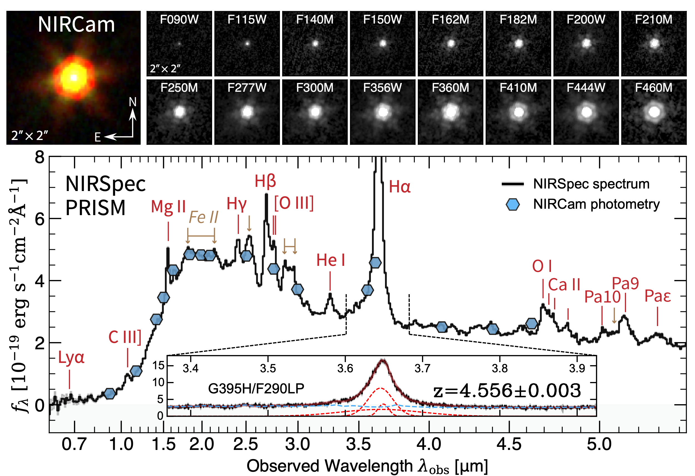

# JWST data for the steep-extinction QSO UDS-27023

JWST/NIRCam imaging and photometry and JWST/NIRSpec spectroscopy of **UDS-27023**, a
steep-extinction quasi-stellar object (SEQ) at *z* = 4.556, released alongside:

> **A Steep-Extinction Quasi-stellar Object at z = 4.6: JWST Evidence for Abundant Small Dust Grains**
> Li, Cai, Maiolino, et al.
> *The Astrophysical Journal Letters* (2026) — [doi:10.3847/2041-8213/ae9863](https://doi.org/10.3847/2041-8213/ae9863)

These are the reduced, science-ready products used to produce Figure 1 of the paper and the
extinction-curve analysis that follows from it.



Figure 1 of the paper, made entirely from the data in this repository.
**Top:** the RGB composite and the 2″ × 2″ cutouts in all 16 NIRCam filters (`NIRCam_image/`).
**Bottom:** the NIRSpec PRISM spectrum (`NIRSpec_spectrum/`, black) with the NIRCam photometry
overplotted (`NIRCam_photometry_UDS-27023.csv`, blue hexagons), showing the strongly suppressed
rest-frame UV continuum. The inset zooms on the G395H/F290LP Hα complex from which
*z* = 4.556 is measured.

---

## Target

| Property | Value |
|---|---|
| Name | UDS-27023 |
| CANDELS ID | 27023 ([Galametz et al. 2013](https://ui.adsabs.harvard.edu/abs/2013ApJS..206...10G)) |
| Field | UKIDSS Ultra Deep Survey (UDS) / SXDS |
| R.A. (J2000, ICRS) | 34.337303 deg = 02:17:20.95 |
| Decl. (J2000, ICRS) | −5.143648 deg = −05:08:37.1 |
| Redshift | *z* = 4.556 ± 0.003 (spectroscopic, broad Hα) |
| Classification | Reddened Type I QSO|

---

## Contents

```
.
├── NIRCam_image/                              NIRCam cutouts, 30" x 30", 0.03"/pix
│   ├── NIRCam_<FILTER>_UDS-27023_30mas_30arcsec.fits    16 files, one per filter
│   ├── NIRCam_RGB_UDS-27023_30mas_30arcsec.fits         3-plane 8-bit RGB, with WCS
│   ├── NIRCam_RGB_UDS-27023_30mas_30arcsec.png          rendered RGB, 30" field
│   └── NIRCam_RGB_UDS-27023_30mas_2arcsec.png           rendered RGB, 2" zoom
├── NIRSpec_spectrum/
│   ├── NIRSpec_PRISM_UDS-27023.csv            PRISM/CLEAR, 0.56-5.49 um
│   └── NIRSpec_G395H_UDS-27023.csv            G395H/F290LP, 2.83-4.00 um
├── NIRCam_photometry_UDS-27023.csv            total fluxes and AB magnitudes, 16 bands
├── figure/
│   ├── figure1.pdf                            Figure 1 of the paper
│   └── figure1.png                            Figure 1 of the paper, coverted to png
├── LICENSE
└── README.md
```

---

## NIRCam imaging

Sixteen filters, all cut from the same custom mosaics and all centred on the target:

`F090W`, `F115W`, `F140M`, `F150W`, `F162M`, `F182M`, `F200W`, `F210M`,
`F250M`, `F277W`, `F300M`, `F356W`, `F360M`, `F410M`, `F444W`, `F460M`

| | |
|---|---|
| File | `NIRCam_<FILTER>_UDS-27023_30mas_30arcsec.fits` |
| Structure | single `PrimaryHDU`, `EXTNAME = 'SCI'`, `float32` |
| Dimensions | 1000 × 1000 pixels |
| Pixel scale | 0.03″/pixel (`PIXAR_A2 = 9.0e-4` arcsec², `PIXAR_SR = 2.1154e-14` sr) |
| Field of view | 30″ × 30″, target at the centre |
| Units | `MJy/sr` (`BUNIT`) |
| Astrometry | full `RA---TAN`/`DEC--TAN` WCS, `RADESYS = ICRS` |

Blank pixels outside the mosaic footprint are `NaN`. The short-wavelength cutouts have a small
uncovered corner (≲0.7% of pixels in F090W–F210M); the long-wavelength cutouts have full coverage.

**Surface brightness → flux.** With `PIXAR_SR = 2.1154e-14` sr:

```
f [nJy per pixel] = value [MJy/sr] x 21.154
m_AB              = -2.5 * log10(f [nJy]) + 31.4
```

**Note on header timing keywords.** `MJD-BEG`/`MJD-AVG`/`MJD-END`, `XPOSURE`, `TELAPSE`,
`PA_APER` and the ephemeris block are inherited unchanged from the parent mosaic. They describe
the mosaic as a whole, not the exposure depth or roll angle at this particular cutout position,
and should not be used as a local depth estimate.

### RGB composite

`NIRCam_RGB_UDS-27023_30mas_30arcsec.fits` holds three 8-bit (`uint8`, 0–255) stretched planes on
the same 1000 × 1000 grid and WCS as the science cutouts. The empty `PrimaryHDU` carries no data.

| HDU | `EXTNAME` | `CHANNEL` | Filters |
|---|---|---|---|
| 1 | `F356W+F444W` | `R` | F356W + F444W |
| 2 | `F200W+F277W` | `G` | F200W + F277W |
| 3 | `F090W+F115W+F150W` | `B` | F090W + F115W + F150W |

These planes are display products: the stretch is non-linear and per-channel, so they are not
photometric and must not be used for measurement. The two PNGs are pre-rendered versions of the
same composite (30″ full field, and the 2″ zoom shown in Figure 1). This RGB fits file can be
opened by SAOImage DS9 with this command:
```sh
ds9 -minmax -rgbimage NIRCam_RGB_UDS-27023_30mas_30arcsec.fits -cmap invert no -frame delete 1
```


---

## NIRCam photometry

`NIRCam_photometry_UDS-27023.csv` — one row per filter, 16 rows.

| Column | Units | Description |
|---|---|---|
| `band` | — | `NIRCam-<FILTER>` |
| `fnjy` | nJy | total flux density |
| `fnjy_err` | nJy | 1σ uncertainty |
| `mag` | AB mag | `-2.5*log10(fnjy) + 31.4` |
| `mag_err` | AB mag | 1σ uncertainty |

Fluxes were measured in EE80-radius circular apertures (radii from
[Table 3 of the NIRCam PSF documentation](https://jwst-docs.stsci.edu/jwst-near-infrared-camera/nircam-performance/nircam-point-spread-functions))
and divided by 0.8 to give total fluxes. This is appropriate here because the source is
point-source-dominated in every band.

The quoted uncertainties are measurement errors only and do not include absolute flux-calibration
systematics.

---

## NIRSpec spectroscopy

Both files share the same three columns:

| Column | Units | Description |
|---|---|---|
| `wavelength` | μm | **observed frame** |
| `flam` | erg s⁻¹ cm⁻² Å⁻¹ | **observed frame** *f*<sub>λ</sub> |
| `flam_err` | erg s⁻¹ cm⁻² Å⁻¹ | 1σ uncertainty |

| File | Disperser/filter | Coverage | Rows | Sampling |
|---|---|---|---|---|
| `NIRSpec_PRISM_UDS-27023.csv` | PRISM/CLEAR | 0.5587–5.4882 μm | 463 | native, 0.0033–0.0193 μm/pixel (*R* ≈ 35–400) |
| `NIRSpec_G395H_UDS-27023.csv` | G395H/F290LP | 2.8300–3.9952 μm | 3800 | uniform, 6.343e-4 μm/pixel (*R* ≈ 2700) |

**G395H coverage.** The file is written on a uniform grid running to 5.2397 μm,
but the last valid row is at 3.9952 μm and everything redward of it is `NaN`
Mask on `isfinite(flam)` before use. This range still contains the redshifted
Hα complex at ≈3.65 μm, which is what the grating data are used for in the paper.

The PRISM resolving power R quoted above is *λ*/(2 Δ*λ*<sub>pixel</sub>) computed directly from the
released wavelength grid: it is lowest (*R* ≈ 35) at 1.2 μm and rises to *R* ≈ 400 at the red end.

**Flux calibration.** Both spectra have already been slit-loss corrected by matching to the NIRCam
photometry with a best-fit quadratic polynomial. In line-free bands the PRISM spectrum agrees with
the broad-band photometry to ≈1% (F200W, F410M, F444W, F460M), so **no further rescaling should be
applied**. The reference value in the paper, *f*<sub>5100 Å</sub> = 2.13 × 10⁻¹⁸ erg s⁻¹ cm⁻² Å⁻¹,
is quoted in the *rest* frame and equals the observed-frame value in these files multiplied by
(1 + *z*) = 5.556.

---

## Quick start

```python
import numpy as np, pandas as pd
from astropy.io import fits
from astropy.wcs import WCS

# --- imaging ---
with fits.open("NIRCam_image/NIRCam_F444W_UDS-27023_30mas_30arcsec.fits") as hdul:
    img, hdr = hdul[0].data, hdul[0].header
wcs = WCS(hdr)
njy = img * 1e6 * hdr["PIXAR_SR"] * 1e9          # MJy/sr -> nJy per pixel

# --- photometry ---
phot = pd.read_csv("NIRCam_photometry_UDS-27023.csv")

# --- spectra ---
prism = pd.read_csv("NIRSpec_spectrum/NIRSpec_PRISM_UDS-27023.csv")
g395h = pd.read_csv("NIRSpec_spectrum/NIRSpec_G395H_UDS-27023.csv").dropna()

z = 4.556
rest_wave = prism["wavelength"] / (1 + z)        # um, rest frame
rest_flam = prism["flam"] * (1 + z)              # erg/s/cm2/AA, rest frame

# --- RGB composite (planes are already in R, G, B HDU order) ---
with fits.open("NIRCam_image/NIRCam_RGB_UDS-27023_30mas_30arcsec.fits") as hdul:
    rgb = np.dstack([hdul[i].data for i in (1, 2, 3)])   # (1000, 1000, 3), uint8
```

---

## Provenance

| Data | Program | PI |
|---|---|---|
| NIRCam imaging | PRIMER, GO #1837 | J. Dunlop |
| NIRCam imaging | [MINERVA](https://arxiv.org/abs/2507.19706), GO #7814 | A. Muzzin, D. Marchesini, K. Suess |
| NIRSpec MSA spectroscopy | GTO #1215 | N. Luetzgendorf |

**NIRCam.** Calibrated single exposures (`_cal.fits`) were retrieved from MAST and reduced with
custom steps including wisp removal, 1/*f* noise removal, sky-background subtraction and
astrometric correction. Mosaics were drizzled to 0.03″ pixels; the cutouts here are extracted from
those mosaics.

**NIRSpec.** Reduced spectra were retrieved from the [Dawn JWST Archive](https://dawn-cph.github.io/dja)
(DJA), which uses the [`msaexp`](https://github.com/gbrammer/msaexp) pipeline. The slit-loss
correction described above was applied on top of the DJA products.

All raw JWST data used in the paper are available from MAST:
[doi:10.17909/yscx-cd19](https://doi.org/10.17909/yscx-cd19).

---

## Citation

If you use these data, please cite the paper:

- Li et al. (2026), *ApJL*, [doi:10.3847/2041-8213/ae9863](https://doi.org/10.3847/2041-8213/ae9863)

A BibTeX entry is available from
[NASA/ADS](https://ui.adsabs.harvard.edu/abs/10.3847/2041-8213/ae9863/exportcitation).

Please also acknowledge the observing programs above, which made these data public with a
zero-exclusive-access period, and the Dawn JWST Archive.

---

## License

Released under the MIT License — see [LICENSE](LICENSE).

## Contact

Mingyu Li — please email lmytime [at] hotmail.com for questions about the data products.
